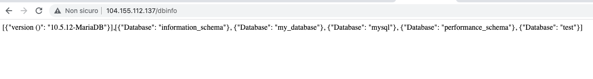
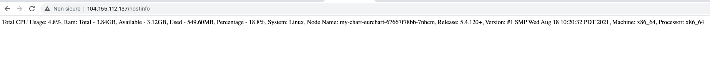

# Demo app

This repo contain solutons for a couple of a quiz.

## Answer 1

For mitigating this type of problem I propose two AWS solution:

- as a temporary solution for restoring the cluster functionality block using inbound acl rules all the Iot devices traffic. After the cluster is up and running again allow a step at a time the IP classes of iot devices;
- expose the endpoint using AWS IoT and AWS IoT Device Defender with specific rules to throttle request.

To investigate using autoscale capacity of Amazon Kinesis Data Firehose for data ingestion between the endpoint and the clustered server.

## Answer 2

Folder content:
- app -> contain the code of the app and the Dockerfile;
- eurchart -> halm chart;
- gke -> terraform code.

As provider I choose GCP (but I can do the same using AWS).

### App

The application is a simple web application using Flask as per requirements in the frontend part.

It expose three rest endpoints:

    1. / : the root for testing the main returning simple "Hello, World!" message;

    2. /hostinfo : it return some resource usage (CPU%, RAM , Kernel version, Processor...);

    3. /dbinfo : gives the version of the database, the list and the schema.

The front-end connect to a MariaDB database as backend. 

For the connection details it takes the env variables as specified in the config section:

```python
config = {
    'host': os.getenv('DB_HOST'),
    'port': int(os.getenv('DB_PORT')),
    'user': os.getenv('DB_USER'),
    'password': os.getenv('DB_PASSWD')
}
```

#### Docker image

In the app folder you find the Dockerfile containing:

```dockerfile
FROM ubuntu:20.04
LABEL maintainer="Ivan Dallaserra <ivandal77@gmail.com>"
RUN apt-get update -y && \
apt-get install -y python3-pip python3-dev libmariadb-dev
# We copy just the requirements.txt first to leverage Docker cache
COPY ./requirements.txt /app/requirements.txt
WORKDIR /app
RUN pip3 install -r requirements.txt
COPY . /app
CMD [ "python3", "./app.py" ]
```

and requiremnts (obtained using pipreqs). 

In order to build:

Build:

```bash
docker build . -t flask_json:latest
```

Retag if needed:

```bash
docker tag flask_json:latest new-repo:tagname
```

Push:

```bash
docker push new-repo:tagname
```

For this demo I had build and pushed the image to a public repo on dockerhub as idallaserra/eurimage.


### Helm Chart

The helm chart deploy the previosly builded app and MariaDB, as helm requiremnt, using [Bitnami image](https://artifacthub.io/packages/helm/bitnami/mariadb).

The app is deployed as a Kubernets deployment with 1 default replica. The replica can be increased as well as an optional Horizontal Pod Autoscaler con can be enabled changing the default helm values.

Persistent Volume in the database part achieves the persistence of the data. 

The app deployment read directly the connection details, as the sensitive root passwd, from the secret generated by MariaDB chart:

```yaml
 env:
 - name: DB_HOST
   value:  {{ .Release.Name }}-mariadb
 - name: DB_USER
   value:  {{ .Values.db.user }}
 - name: DB_PASSWD
   valueFrom:
     secretKeyRef:
       name: {{ .Release.Name }}-mariadb
       key: mariadb-root-password
```

The app uses the Kubernetes Service of type ClusterIP avoiding external traffic to the cluster for DB connection.

In order to install the app using helm (it requires helm with preconfigured K8s):

```bash
helm install chartname eurchart/ --values eurchart/values.yaml
```

### Terraform Cluster Creation and APP auto-install

The gke folder contain a simple terraform script deploying the app in a new Kubernetes GKE cluster.

It required a working GCP account and a configured gcloud SDK ([here](https://cloud.google.com/sdk/docs/quickstart) reference to install and configure).

In order to install the application run terraform plan followed by terraform apply from the gke folder.

The script interactively ask for some GCP information or set the defautl values in variables.tf files:

```bash
var.project_id
  The GCP project ID in wich create the resources.
  Enter a value: test-15938
var.region
  The GCP region.
  Enter a value: europe-west1
var.zone
  The GCP zone.
  Enter a value: europe-west1-c
```

As output the terraform script provide the ip address of the balancer in GCP exposing the app.

Finally you can check the app is working opening a browser to http://balancer_ip_addr/dbinfo



 and http://balancer_ip_addr/hostinfo




### Consideration and improvements

This is only a demo version far for being production ready. 
The following improvements can in fact be considered:

- all the code can be impoved (description, more variabvles etc);
- the app is using ubuntu as base image, other hardened image con be used for reducing the security vulnerabilities;
- https in place of http with a valid FQDN domain (ingress controller with let's encrypt or cloud provider solution);
- a Cloud Armor for DDOS and WAF protecting the load balancer;
- the GKE cluster in place are VPC native and the node has public ip addresss. A complete private cluster with both nodes and k8s api on private network can be used;
- there is no pipline in place for checking the code, building the docker image, testing and scanning for vulnerabilities and finally deploying it;
- terraform code can be impoved and runned in another pipline, with locking state...
 


